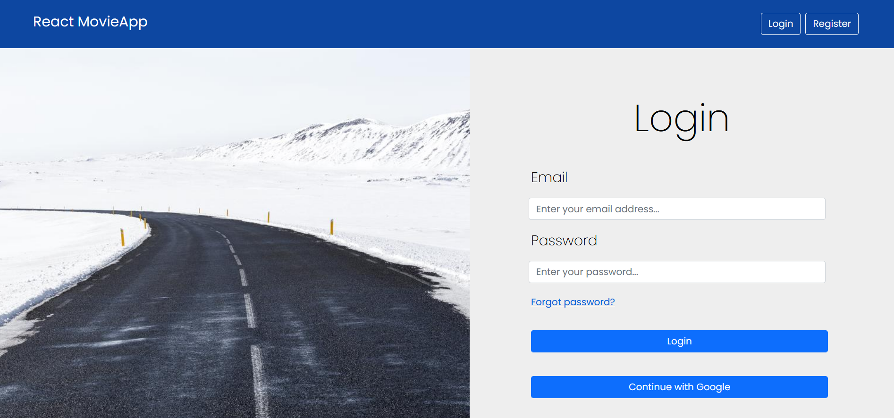
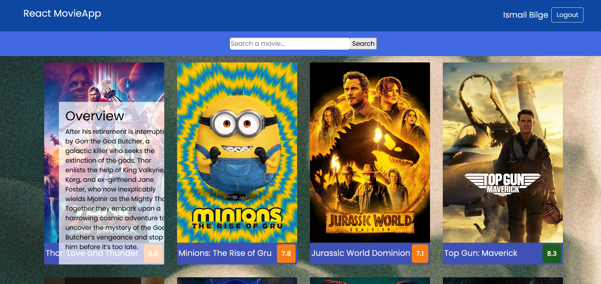
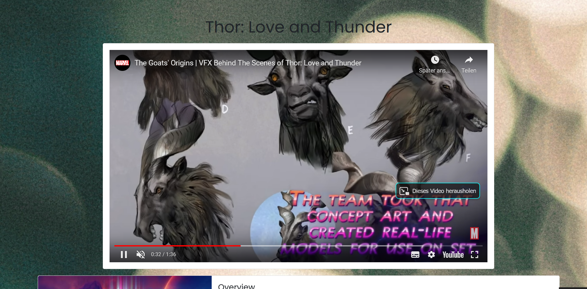

#  :clapper: find-movie-app :film_projector:
> Find-Movie app gives you popular movies to watch. You can view detail informations, when you go over the photo and then click on it!

## Table of contents
  - [Table of contents](#table-of-contents)
  - [General info](#general-info)
  - [Technologies](#technologies)
  - [Features](#features)
  - [How to use](#how-to-use)
  - [Screenshots](#screenshots)
  - [Contact](#contact)

## General info
This project is a React application. It is created to sharpen the knowledge of React.js along with Router and Hooks of React and using API data. Additional to React.js, Firebase(Authentication) is also used in this project.
It is a part of Team Projects of The Clarusway IT School - Fullstack Developer Path.

## Technologies
* React.js - version 18.2.01
* Firebase

## Features
* Login with your account
* Gives the picture and the name of movies in main appearence
* Search the name of movie
* Go on the name/photo to see details and get informations
* Click on the movie and see more details and Trailer of movie

## How to use

Click on this [link](https://find-movie-app.vercel.app/)

```bash
# Clone this repository
$ git clone https://github.com/i-bilge/find-movie-app.git

# Go into the find-movie-app folder (if you are not)
$ cd find-movie-app

# Install dependencies
$ npm install


# Create a Firebase project and register your app
link to firebase: https://firebase.google.com/docs/samples?hl=en

# Install dependencies(I AM NOT SHARING MY OF CONFIG: YOU HAVE TO USE YOURS!)
$ npm install firebase


# Take api key from themoviedb.org
link to The Movie Date Base: https://developers.themoviedb.org/3/getting-started/authentication

# Run the app
$ npm start
```


## Screenshots







## Contact
:mailbox_with_mail: You can send me email : iismailbilge@gmail.com :mailbox_with_mail:
